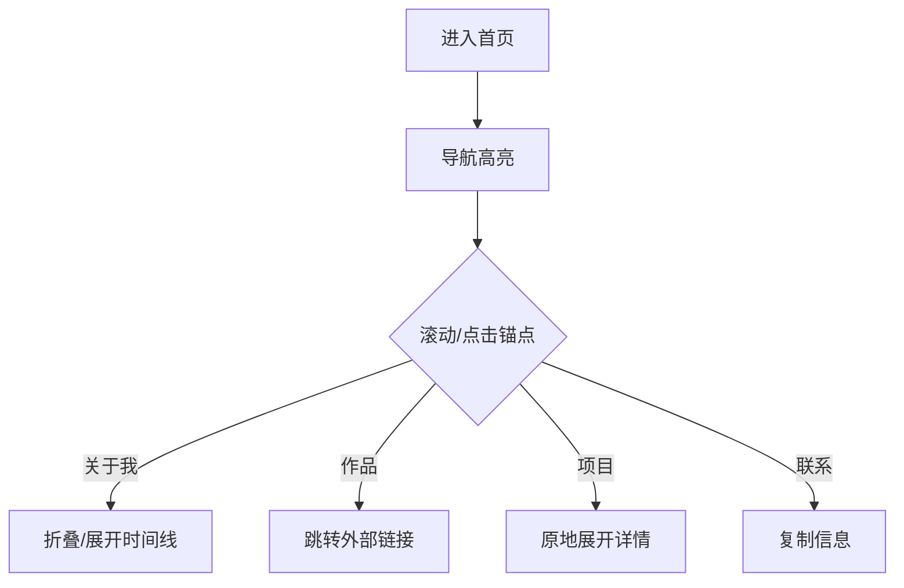

## 1. 产品概述
一个面向个人品牌展示的动态卡片式作品集网站，用可视化交互替代传统简历，帮助访客在 60 秒内快速了解作者优势、作品与项目深度。

## 2. 核心功能

### 2.1 用户角色
| 角色 | 注册方式 | 核心权限 |
|------|----------|----------|
| 访客 | 无需注册 | 浏览全部卡片、展开/折叠、拖拽排序、复制联系信息 |

### 2.2 功能模块
网站由 1 个单页构成，内部划分为三大卡片组：
1. **关于我**：个人优势、教育、工作、技能卡片
2. **个人作品**：文章卡片（企业新闻、活动报道、采访、产品宣传）、视频卡片
3. **项目经历**：3-4 个项目卡片，支持原地展开详情

### 2.3 页面细节
| 页面 | 模块 | 功能描述 |
|------|------|----------|
| 单页 | 导航锚点 | 点击平滑滚动到对应卡片组 |
| 单页 | 关于我卡片组 | 展示个人优势、教育、工作、技能四张卡片，支持折叠成一条时间线 |
| 单页 | 文章卡片组 | 按分类展示 4 篇最新文章封面+标题+摘要，点击“阅读”跳转原文 |
| 单页 | 视频卡片组 | 展示 2-4 个视频封面，点击“播放”跳转外部平台 |
| 单页 | 项目卡片组 | 3-4 个项目卡片，点击展开详情（背景、职责、成果、技术栈），再次点击折叠 |
| 单页 | 底部联系卡片 | 一键复制邮箱 / 微信 / LinkedIn，显示复制成功提示 |

## 3. 核心流程
访客进入 → 导航锚点高亮 → 滚动或点击锚点 → 卡片自动进入“聚焦”状态 → 用户展开/折叠/拖拽 → 离开页面

## 4. 用户界面设计

### 4.1 设计风格
- 主色：#0A0A0A（深空黑），辅色：#00F5A0（荧光绿点缀）
- 按钮：2 px 圆角 + 荧光绿描边，悬停时放大 1.05 倍
- 字体：Inter 14 px 正文，18 px 标题，20 px 卡片标题
- 布局：1200 px 最大宽度，12 列网格，卡片间距 24 px
- 图标：线性单色图标，悬停填充荧光绿

### 4.2 页面设计概览
| 模块 | 状态 | UI 元素 |
|------|------|----------|
| 关于我卡片 | 初始 | 圆角 16 px 白色卡片，左侧头像，右侧 4 段信息，折叠按钮在右上角 |
| 关于我卡片 | 折叠 | 高度收缩为 80 px 时间轴，仅显示节点与年份 |
| 文章卡片 | 聚焦 | 图片放大 1.1 倍，阴影加深，出现“阅读”荧光绿按钮 |
| 项目卡片 | 展开 | 高度自适应，内部出现二级卡片（背景、职责、成果、技术栈） |
| 拖拽排序 | 交互中 | 卡片透明度 70 %，鼠标 grabbing 状态，网格出现虚线占位 |

### 4.3 响应式
桌面优先，≥1024 px 完整体验；768-1024 px 两列网格；≤768 px 单列堆叠，手势滑动切换卡片组，拖拽自动关闭。

### 4.4 动画规范
- 卡片进入：stagger 0.1 s，fade-in-up 0.4 s ease-out
- 展开/折叠：height auto 动画 0.3 s ease-in-out
- 拖拽：react-beautiful-dnd 默认曲线
- 按钮点击：scale(0.95) 0.1 s 弹性回弹