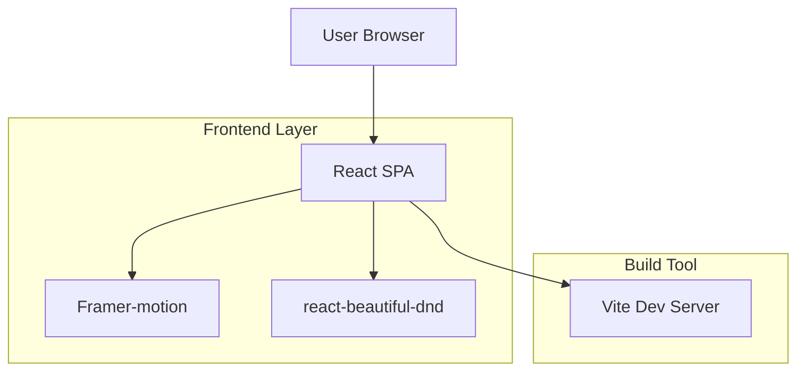
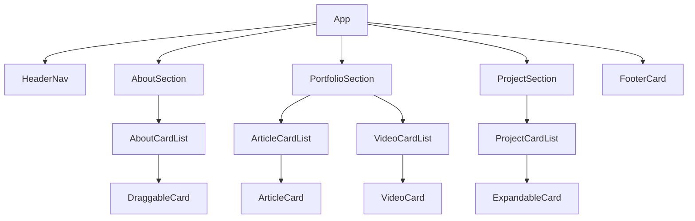

## 1. 架构设计



## 2. 技术描述
- Frontend：React@18 + Vite + TypeScript + TailwindCSS@3
- Initialization Tool：vite-init
- Backend：无（纯静态部署，数据硬编码在 src/data/portfolio.ts）
- 部署：Vercel / Netlify 零配置

## 3. 路由定义
| Route | Purpose |
|-------|---------|
| / | 单页作品集，锚点滚动到三大卡片组 |

## 4. 数据模型（前端硬编码）

### 4.1 类型定义
```ts
export interface AboutCard {
  id: string
  type: 'advantage' | 'education' | 'work' | 'skill'
  title: string
  content: string[]
  period?: string
}

export interface ArticleCard {
  id: string
  category: 'news' | 'event' | 'interview' | 'product'
  title: string
  excerpt: string
  cover: string
  link: string
}

export interface VideoCard {
  id: string
  title: string
  cover: string
  link: string
}

export interface ProjectCard {
  id: string
  title: string
  subtitle: string
  cover: string
  detail: {
    background: string
    responsibility: string
    result: string
    tech: string[]
  }
}
```

### 4.2 示例数据（src/data/portfolio.ts）
```ts
export const aboutCards: AboutCard[] = [
  { id:'1', type:'advantage', title:'个人优势', content:['5 年品牌传播经验','数据驱动创意'] },
  { id:'2', type:'education', title:'教育', content:['XX大学 新闻传播学士'], period:'2015-2019' },
]

export const articleCards: ArticleCard[] = [
  { id:'a1', category:'news', title:'XX公司获A轮融资', excerpt:'报道XX公司...', cover:'/img/news.jpg', link:'https://example.com/news' },
]

export const projectCards: ProjectCard[] = [
  { id:'p1', title:'品牌升级项目', subtitle:'2023Q2', cover:'/img/prj1.jpg', detail:{ background:'...', responsibility:'...', result:'...', tech:['React','Figma'] } },
]
```

## 5. 组件层级


## 6. 性能预算
- 首屏 JS ≤ 150 kB（gzip）
- 图片使用 next-gen 格式（webp/avif）
- 动画使用 GPU 加速（transform/opacity）
- 骨架屏占位，首屏渲染 ≤ 1.5 s on 4G